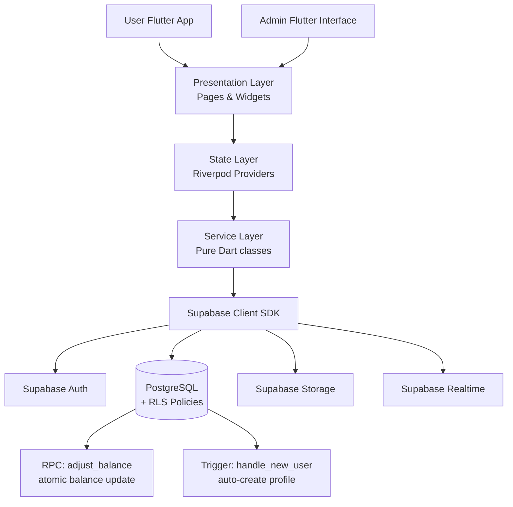

<div align="center">

# 🌱 EcoPick UAS — EcoPoin

> **Ubah Sampahmu Jadi GreenCoin** — gerakan daur ulang Surabaya berbasis aplikasi mobile.

[](https://flutter.dev)
[](https://dart.dev)
[](https://supabase.com)
[](https://riverpod.dev)
[](#-test)
[](#)

</div>

---

## 📋 Daftar Isi

- [Tentang Project](#-tentang-project)
- [Fitur Utama](#-fitur-utama)
- [Tech Stack](#-tech-stack)
- [Arsitektur](#-arsitektur)
- [Struktur Folder](#-struktur-folder)
- [Setup & Instalasi](#-setup--instalasi)
- [Akun Demo](#-akun-demo)
- [Database & Migration](#-database--migration)
- [Business Rules](#-business-rules)
- [Skrip Penting](#-skrip-penting)
- [Test](#-test)
- [Roadmap & TODO](#-roadmap--todo)
- [Lisensi](#-lisensi)

---

## 🌍 Tentang Project

**EcoPoin** adalah aplikasi mobile Flutter + Supabase yang membantu masyarakat mengelola aktivitas daur ulang sampah menjadi saldo digital bernama **GreenCoin (GC)**. Setiap kilogram sampah yang disetor diubah menjadi GC berdasarkan rate kategori yang ditentukan admin. Saldo GC dapat:

- 💸 **Dicairkan ke e-wallet** (DANA, GoPay, OVO, ShopeePay) — minimal Rp 10.000.
- 🛒 **Ditukar di Marketplace** dengan barang kebutuhan sehari-hari (beras, minyak, detergen, dll).

Project ini dibangun sebagai tugas akhir UAS dengan fokus pada arsitektur **feature-first**, **RLS Supabase**, dan **operasi saldo atomik** via RPC PostgreSQL.

### Konversi GreenCoin

```
1 GC = Rp 100   (configurable di core/constants/app_strings.dart)
```

---

## ✨ Fitur Utama

### 👤 Sisi User
| Fitur | Deskripsi |
|---|---|
| 🏠 **Beranda** | Dashboard dinamis: saldo, total sampah, total transaksi, CO2 dihemat, grafik aktivitas 7 hari, breakdown kategori, riwayat terbaru. Empty state untuk akun baru. |
| 🚛 **EcoPick** | Pengajuan penjemputan sampah ke lokasi user. Pilih kategori, berat, tanggal, slot waktu, lokasi. Validasi berat ≤ 0 → popup. |
| 📍 **EcoDrop** | Setor mandiri ke Bank Sampah Induk Surabaya. Upload foto bukti, kategori, berat. |
| 💰 **GreenCoin Wallet** | Saldo + konversi Rupiah, riwayat transaksi (filter Semua/Masuk/Keluar), tarik dana via bottom sheet. |
| 🛍 **Marketplace** | Tukar GC dengan produk fisik. Setiap produk ada emoji (🍚 🛢️ 🧺 🧼 🪥 dst), nama, stok, harga. |
| 📊 **Status Transaksi** | Daftar semua EcoPick/EcoDrop user dengan status (pending/process/completed/rejected). |
| 👤 **Profil** | Edit nama, telepon, ganti password, logout. |
| 🚪 **Login Cepat** | Chip akun yang pernah login — tap untuk auto-fill + auto-submit (credential disimpan via `flutter_secure_storage` terenkripsi). |

### 🛠 Sisi Admin
| Fitur | Deskripsi |
|---|---|
| 📊 **Overview Dashboard** | Statistik platform: total pengguna, transaksi, sampah terkumpul, GC beredar, log aktivitas terbaru. |
| 👥 **Users Management** | List semua user, search, lihat detail aktivitas. |
| 🚛 **EcoPick Management** | Pantau permintaan penjemputan, set status completed/rejected. |
| 📍 **EcoDrop Management** | Verifikasi setor mandiri, set status. |
| 💸 **Transactions & GreenCoin** | Pantau seluruh transaksi GC, withdraw yang sedang diproses, total beredar/dicairkan. |
| 🛒 **Marketplace Management** | CRUD produk: nama, deskripsi, emoji, harga GC, stok, status aktif. |
| 📚 **Master Data** | CRUD kategori sampah + rate GC per kg. |

---

## 🛠 Tech Stack

| Layer | Tools |
|---|---|
| **Frontend** | Flutter 3.41, Dart 3.5+ |
| **State** | [`flutter_riverpod`](https://pub.dev/packages/flutter_riverpod) 2.5 |
| **Routing** | [`go_router`](https://pub.dev/packages/go_router) 14.2 (ShellRoute untuk bottom nav) |
| **Backend** | Supabase: PostgreSQL + Auth + Storage + Realtime + Edge Functions |
| **Secure storage** | [`flutter_secure_storage`](https://pub.dev/packages/flutter_secure_storage) 9.2 (untuk Login Cepat) |
| **Charts** | [`fl_chart`](https://pub.dev/packages/fl_chart) 0.68 |
| **i18n & format** | [`intl`](https://pub.dev/packages/intl) (Rupiah, tanggal Indonesia) |
| **Env config** | [`flutter_dotenv`](https://pub.dev/packages/flutter_dotenv) |
| **Picker gambar** | [`image_picker`](https://pub.dev/packages/image_picker) (untuk EcoPick/EcoDrop foto bukti) |
| **Testing** | `flutter_test`, `integration_test`, `mocktail` |

---

## 🏗 Arsitektur



**Lapisan:**
- **Presentation** — `lib/features/*/presentation/` — screens, widgets, bottom sheets.
- **State** — `lib/features/*/providers/` — Riverpod `Provider` / `StateNotifierProvider` / `FutureProvider`.
- **Domain / Models** — `lib/features/*/models/` — immutable data classes dengan `fromMap`.
- **Service / Data** — `lib/features/*/data/` — komunikasi ke Supabase. Tidak ada query DB langsung di widget.
- **Database** — `supabase/migrations/` SQL untuk schema + `supabase/policies.sql` untuk RLS + `supabase/seed.sql` untuk default data.

---

## 📁 Struktur Folder

```
ecopoin_app/
├── lib/
│   ├── main.dart                  # Entry point — init Supabase, dotenv, intl
│   ├── app.dart                   # MaterialApp.router dengan AppTheme
│   ├── core/
│   │   ├── config/                # supabase_config.dart (init + isConfigured)
│   │   ├── constants/             # app_colors, app_sizes, app_strings (enum & const)
│   │   ├── errors/                # AppException, AuthException, InsufficientBalance
│   │   ├── routing/               # app_router.dart (ShellRoute + 6 tabs)
│   │   ├── theme/                 # app_theme.dart (Material3, green identity)
│   │   └── utils/                 # formatters (Rupiah, GC, weight), validators
│   ├── shared/
│   │   └── widgets/               # Reusable: AppCard, PrimaryButton, StatusBadge,
│   │                              # LabeledField, EcoLogo, MainShell, SuccessHeader,
│   │                              # MotionFadeSlide (animasi entrance)
│   └── features/
│       ├── auth/                  # Landing, Login (dengan Login Cepat chips), Register
│       ├── dashboard/             # User home: metrics, weekly chart, kategori, recent
│       ├── ecopick/               # Form penjemputan + success page
│       ├── ecodrop/               # Form setor mandiri + success page
│       ├── greencoin/             # Wallet + withdraw bottom sheet + success page
│       ├── marketplace/           # Katalog produk + exchange flow
│       ├── status/                # Daftar status transaksi
│       ├── profile/               # Edit profil + ubah password
│       └── admin/                 # Admin overview, drawer, master data, marketplace mgmt
├── supabase/
│   ├── migrations/0001_init.sql   # Schema: 9 tabel + trigger + RPC
│   ├── policies.sql               # RLS user/admin policies
│   └── seed.sql                   # Default kategori sampah + produk
├── test/widget_test.dart          # Unit tests untuk formatters & validators
├── .env.example                   # Template — SUPABASE_URL + SUPABASE_ANON_KEY
├── .gitignore                     # Termasuk .env, .mcp.json (NEVER commit)
├── pubspec.yaml
└── README.md (kamu sedang baca ini)
```

> **Feature-first** seperti yang disarankan PRD. Setiap fitur self-contained dengan `data/models/providers/presentation`.

---

## 🚀 Setup & Instalasi

### Prasyarat

- Flutter SDK ≥ 3.41 ([install guide](https://docs.flutter.dev/get-started/install))
- Dart SDK ≥ 3.5 (ikut dengan Flutter)
- Akun Supabase ([daftar gratis](https://supabase.com))
- Android Studio / Xcode untuk run di emulator/device

### 1. Clone repo

```bash
git clone https://github.com/BlindCr/EcoPick-UAS.git
cd EcoPick-UAS
```

### 2. Install dependencies

```bash
flutter pub get
```

### 3. Setup Supabase

**a)** Buat project baru di [supabase.com/dashboard](https://supabase.com/dashboard) → ambil **URL** dan **anon key** dari Settings → API.

**b)** Salin `.env.example` ke `.env`:

```bash
cp .env.example .env
```

**c)** Isi `.env`:

```dotenv
SUPABASE_URL=https://xxxx.supabase.co
SUPABASE_ANON_KEY=eyJhbGciOi...
```

> **Penting**: `.env` sudah ada di `.gitignore` — JANGAN commit. Jika `.env` belum diisi (masih placeholder), aplikasi otomatis jalan dalam **demo mode** dengan data dummy.

**d)** Jalankan SQL berurutan di Supabase SQL Editor:

| Step | File | Fungsi |
|---|---|---|
| 1 | `supabase/migrations/0001_init.sql` | Schema 9 tabel + trigger updated_at + trigger handle_new_user + RPC `adjust_balance` |
| 2 | `supabase/policies.sql` | RLS policy: user akses data sendiri, admin akses lintas-user |
| 3 | `supabase/seed.sql` | 7 kategori sampah + 4 produk marketplace default |

**e) (Opsional)** Promote user pertama jadi admin (setelah register lewat app):

```sql
update public.profiles set role = 'admin' where email = 'email-anda@example.com';
```

### 4. Run

```bash
# Android emulator / device
flutter run

# iOS Simulator
flutter run -d iPhone
```

---

## 🔑 Akun Demo

Setelah migration + seed dijalankan, akun admin sudah otomatis ter-setup:

| Role | Email | Password |
|---|---|---|
| Admin | `admin@ecopoin.id` | `admin12345` |

Login sebagai admin → otomatis redirect ke `/admin`.
Login sebagai user biasa → otomatis ke `/home` (Beranda).

User baru dapat register lewat halaman **Daftar Akun Baru** — trigger `handle_new_user` otomatis bikin row di `profiles` dengan role `user` dan saldo 0 GC.

> **Demo Mode**: Kalau `.env` belum diisi (placeholder), aplikasi pakai user dummy `Alexa M.` untuk preview UI tanpa setup backend.

---

## 🗄 Database & Migration

### Tabel

| Tabel | Deskripsi |
|---|---|
| `profiles` | Data user publik (linked ke `auth.users.id`) + saldo + role |
| `waste_categories` | Kategori sampah + rate GC per kg + flag aktif |
| `ecopick_requests` | Permintaan penjemputan sampah |
| `ecodrop_requests` | Setor sampah mandiri |
| `greencoin_transactions` | Ledger semua transaksi GC (immutable history) |
| `withdraw_requests` | Permintaan pencairan ke e-wallet |
| `marketplace_products` | Katalog produk + harga GC + emoji |
| `marketplace_orders` | Order penukaran GC ↔ produk |
| `platform_logs` | Audit log admin actions |

### RLS Policies

Setiap tabel user-facing punya RLS aktif. Pattern:

- **User**: `auth.uid() = user_id` → bisa read/insert data sendiri.
- **Admin**: `public.is_admin(auth.uid())` → bisa read/write lintas user.

### RPC: `adjust_balance`

Operasi saldo wajib lewat fungsi ini agar atomic:

```sql
select public.adjust_balance(
  p_user_id => 'uuid',
  p_amount => 150,           -- positif = earn, negatif = withdraw/exchange
  p_source_type => 'ecopick',
  p_source_id => 'tx-uuid',
  p_transaction_type => 'earn',
  p_description => 'EcoPick — 2 kg plastik'
);
```

Function:
1. Update `profiles.green_coin_balance`.
2. Raise exception jika saldo jadi negatif.
3. Insert ledger row di `greencoin_transactions`.

---

## 📐 Business Rules

| Rule | Implementasi |
|---|---|
| GC bertambah saat EcoPick/EcoDrop `completed` | `EcoPickService.submit()` & `EcoDropService.submit()` panggil `adjust_balance` |
| GC berkurang saat withdraw / marketplace order | Sama via `adjust_balance` dengan amount negatif |
| Withdraw minimal Rp 10.000 | Validasi di `WithdrawBottomSheet` |
| Berat sampah ≤ 0 → popup tidak valid | EcoPick & EcoDrop validate sebelum submit |
| Stok marketplace → produk habis tidak bisa ditukar | `MarketplaceService.exchange()` cek stok terbaru di DB sebelum order |
| Saldo dikembalikan jika order dibatalkan | TODO (currently soft-delete only) |
| Admin tidak bisa di-edit jadi role user dari client | RLS policy block update role pada `profiles` |
| Estimasi CO2 dihemat | `kg sampah × 0.34` (kg CO2 saved per kg recycled) |

---

## 🧰 Skrip Penting

```bash
# Run di device
flutter run

# Run dengan device tertentu
flutter devices
flutter run -d <device-id>

# Test
flutter test

# Analyze (lint + type check)
flutter analyze

# Build APK Android release
flutter build apk --release

# Build iOS (perlu Mac + Xcode)
flutter build ios --release

# Generate icon launcher (jika setup flutter_launcher_icons)
flutter pub run flutter_launcher_icons

# Clean & rebuild
flutter clean && flutter pub get
```

---

## 🧪 Test

```bash
flutter test
```

Yang sudah ada di [test/widget_test.dart](test/widget_test.dart):

- ✅ `Formatters` — konversi GC ↔ Rupiah, format berat, format GreenCoin
- ✅ `Validators` — email valid, password ≥ 8 char, format telepon Indonesia

**Hasil**: 6/6 passing. `flutter analyze` 0 errors.

---

## 🗺 Roadmap & TODO

### ✅ Selesai

- [x] Auth Supabase (signup/signin/signout) + auto-create profile via trigger
- [x] Login Cepat (chip akun yang pernah login dengan secure storage)
- [x] Role-based routing (admin → /admin, user → /home)
- [x] Dashboard real-time dari Supabase (empty state untuk akun baru)
- [x] EcoPick + EcoDrop dengan validasi berat + save atomik
- [x] GreenCoin wallet + withdraw flow + success page
- [x] Marketplace dengan emoji + exchange (decrement stok + balance)
- [x] Admin: overview, master data (kategori), marketplace management
- [x] RLS Policies + RPC adjust_balance
- [x] Theme hijau konsisten dengan animasi entrance (MotionFadeSlide)

### 🚧 Belum (TODO)

- [ ] Integrasi `google_maps_flutter` untuk picker lokasi EcoPick (saat ini placeholder)
- [ ] Upload foto bukti EcoDrop ke Supabase Storage
- [ ] Realtime subscription untuk status update (notif user saat admin approve)
- [ ] Withdraw oleh user yang ditolak → refund saldo otomatis (saat ini perlu manual)
- [ ] Admin sub-pages: detail user, detail EcoPick/EcoDrop dengan tombol approve/reject
- [ ] Refactor [admin_dashboard_page.dart](lib/features/admin/dashboard/admin_dashboard_page.dart) (2543 baris) menjadi file per-section
- [ ] Push notification via FCM
- [ ] CI/CD pipeline (GitHub Actions: lint + test on PR)

---

## 📸 Screenshot

> Tambahkan screenshot di sini setelah build:
>
> ```
> docs/screenshots/
>   ├── landing.png
>   ├── dashboard.png
>   ├── ecopick.png
>   ├── greencoin.png
>   ├── marketplace.png
>   └── admin-overview.png
> ```

---

## 👤 Author

**Hariz** — UAS Mobile Programming

- GitHub: [@BlindCr](https://github.com/BlindCr)

---

## 📜 Lisensi

Project akademik EcoPoin UAS. Bebas untuk pembelajaran & referensi. Tidak untuk komersial tanpa izin.

---

<div align="center">

### 🌱 Dibangun dengan ❤️ untuk Surabaya yang lebih hijau

</div>
